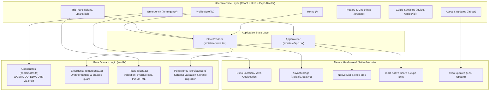

# TrailSafe Architecture & Technical Reference

This document provides a comprehensive technical reference for the architecture, subsystems, data flow, and design patterns implemented in **KCESAR TrailSafe**.

---

## 1. System Overview

TrailSafe is an offline-first, client-only React Native application built with Expo SDK 57 and Expo Router. It serves as a wilderness safety companion, providing location translation (DD, DDM, UTM), Search & Rescue (SAR) trip planning, offline first-aid guides, and emergency checklists.

### Architectural Tenets
1. **Zero Remote Dependencies**: The core features—location acquisition, coordinate math, trip planning, PDF generation, and survival guides—require zero network connectivity.
2. **Strict Client-Side Privacy**: No user accounts, advertising identifiers, analytics SDKs, cloud databases, or background tracking.
3. **Defensive Safety Interlocks**: Emergency actions (911 calling/texting) are gated by an explicit `Practice Mode` to prevent accidental dispatch calls during preparation or training.
4. **Resilient Local Persistence**: Local state is saved to `AsyncStorage` with serialized queuing and schema integrity validation. Corrupted files fail safely without overwriting user data.

---

## 2. Architecture Diagram



---

## 3. Core Subsystems

### A. Location & Coordinate Processing Subsystem
- **Files**: `src/lib/coordinates.ts`, `src/hooks/use-location.ts`, `src/components/trailsafe/location-card.tsx`
- **Lifecycle**:
  - `useAutomaticLocation(enabled)` mounts on emergency and location screens.
  - Automatically activates the GPS hardware without requiring a manual "Get Location" button.
  - Tracks `AppState`: automatically suspends GPS watching when the app is backgrounded or inactive to conserve battery and protect privacy.
  - On web, uses native `navigator.geolocation` directly to avoid Expo 57's known subscriber ID collision bug.
- **Coordinate Transformations**:
  - **DD (Decimal Degrees)**: WGS84 coordinates formatted to 5 decimal places (~1.1 meter precision).
  - **DDM (Degrees & Decimal Minutes)**: Formatted as `DD° MM.mmm′` with rounding carry over 59.99995+ minutes to prevent `60.000′`. Used by aviation rescue (King County Sheriff Air Support).
  - **UTM (Universal Transverse Mercator)**: Projected using `proj4` against WGS84 datum. Correctly handles zone determination (1-60), northern/southern hemispheres, and special exceptions for Norway (32V) and Svalbard (31X, 33X, 35X, 37X).
- **Integrity & Warning System**:
  - `stale`: Fix age >= 120 seconds.
  - `low accuracy`: Uncertainty radius > 100 meters.
  - `mocked`: Flagged as simulated location by the operating system.

### B. Trip Planning & Dual Vehicle Subsystem
- **Files**: `src/lib/plans.ts`, `src/app/plans/[id].tsx`, `src/app/profile.tsx`
- **Trip Plan Lifecycle**:
  - `draft`: In-progress trip plan being edited. Partial validation allowed.
  - `current`: Active trip in progress. Subject to overdue monitoring.
  - `completed`: Trip safely concluded.
- **Dual Vehicle Profile**:
  - Hikers can save up to two vehicles in their profile:
    - Primary Vehicle (Car 1): `vehicle` (color, make, model) and `plate` (license plate & state).
    - Secondary Vehicle (Car 2): `vehicle2` and `plate2`.
  - When creating or editing a trip plan, one-tap quick-selection pills (`Car 1` / `Car 2`) allow instant population of the trailhead vehicle fields without manual retyping.
- **Overdue Calculations & Time Zones**:
  - `suggestOverdue(returnDate, returnTime, hours = 2)` safely computes overdue deadlines across midnight and year boundaries in UTC.
  - `isOverdue(plan, now)` evaluates the deadline against the device clock converted to the plan's specific IANA `timeZone` string (e.g. `America/Los_Angeles`).
- **Export & Sharing**:
  - `buildPlanText(plan)`: Compiles formatted text with rescue instructions, contact info, party details, and SAR gear.
  - `planHTML(plan)`: Clean HTML template with XSS escaping (`escapeHTML`).
  - `exportPlan(plan)`: Native PDF generation via `expo-print` and presentation via `expo-sharing`.

### C. Emergency Dispatch & Practice Isolation Subsystem
- **Files**: `src/lib/emergency.ts`, `src/state/app.tsx`, `src/components/trailsafe/emergency-actions.tsx`
- **Guarded Execution Flow**:
  ```mermaid
  sequenceDiagram
      actor User
      participant UI as EmergencyActions
      participant App as AppProvider
      participant Guard as performEmergencyAction
      participant OS as Native OS (Dialer/SMS)

      User->>UI: Tap "Call 911" or "Text 911"
      UI->>App: emergency(kind, situation)
      App->>Guard: performEmergencyAction(practice, kind, handlers)
      alt Practice Mode is ON (practice === true)
          Guard->>App: handlers.simulate(action)
          App->>UI: Show "Practice Mode" modal dialog
          Note over OS: Zero network or telecom requests made
      else Practice Mode is OFF (practice === false)
          Guard->>OS: handlers.call() -> tel:911 OR handlers.text() -> sms:911
      end
  ```
- **Overdue vs Self-Rescue Location Logic**:
  - Self-Rescue / Active Emergency: Leads with caller's current GPS coordinates.
  - Overdue / Missing Person: Prompts for the *missing person's last known location* instead of the caller's GPS coordinates.

### D. Persistence & Concurrency Subsystem
- **Files**: `src/lib/persistence.ts`, `src/state/store.tsx`
- **Serialized Promise Queue**:
  - AsyncStorage writes are serialized sequentially through a promise queue ref:
    `queue.current = queue.current.then(...)`
  - Eliminates race conditions and torn writes when multiple state updates occur rapidly.
- **Data Integrity & Non-Destructive Failure**:
  - `parseStoredData(raw)` checks all required fields, types, and time zones.
  - If parsing fails, it throws without resetting AsyncStorage, preserving the user's raw file for recovery.
  - `writable` flag remains `false`, preventing subsequent writes from overwriting damaged data.
- **Schema Migration**:
  - Automatically migrates legacy profiles lacking `vehicle2`/`plate2` to default empty strings.

### E. Theme & WCAG Contrast Architecture
- **Files**: `src/components/trailsafe/theme.ts`, `src/components/trailsafe/ui.tsx`, `tests/theme.test.ts`
- **Separation of Tokens**: Design tokens are isolated in pure TypeScript (`theme.ts`) to permit direct Node testing without bundling.
- **Semantic Tokens**:
  - `headerBg`: Deep PNW forest green (#1B3A2E light / #13231B dark)
  - `heading`: High-contrast heading text (>= 12:1 in both themes)
  - `kicker`: Subtitle kicker text (>= 8:1 in both themes)
  - `locationCardBg` & `locationCardBorder`: Deep emerald card surfaces
  - `btnPrimaryBg` & `btnPrimaryText`: Primary action buttons (>= 6.5:1 in dark mode)
  - `btnOutlineBorder` & `btnOutlineText`: Outline action buttons (>= 11:1 in dark mode)
  - `checkBg`: Elevated slate background (#28352D) for active tabs and checked rows
- **Automated Verification**: `tests/theme.test.ts` mathematically verifies standard W3C relative luminance and contrast ratios across all critical pairings (>= 4.5:1 for body text, >= 3.0:1 for bold/display text).

---

## 4. Offline Content Engine

- **Files**: `src/content/library.json`, `src/content/index.ts`, `src/components/trailsafe/article-body.tsx`
- **Bundled Articles**: 20 complete, offline articles covering:
  - Hypothermia, heat illness, dehydration, and altitude sickness.
  - Navigation with map and compass, lost hiker protocols, and low-signal communication.
  - Ten Essentials checklists, winter layering, shelter building, and wildlife safety.
- **Search Engine**: In-memory full-text search across titles, summaries, keywords, and body text with zero external dependencies.

---

## 5. Verification & Testing Strategy

| Test Suite | Framework | Command | Scope |
| :--- | :--- | :--- | :--- |
| **Unit & Math Tests** | `node:test` + `tsx` | `npm test` | Coordinates, UTM projections, date wrapping, storage migration, practice guards. |
| **Theme Contrast Tests** | `node:test` + `tsx` | `npm test` | Mathematical W3C relative luminance and contrast ratios for WCAG AA compliance. |
| **Type Integrity** | `tsc --noEmit` | `npm run typecheck` | Strict TypeScript compilation across all app routes and components. |
| **Linter** | `eslint` | `npx eslint .` | React Compiler, React Native, and Expo Router lint rules. |
| **Web Export** | `expo export` | `npx expo export --platform web` | Validates static route generation across all 12 routes. |
| **End-to-End Tests** | Playwright | `npm run test:e2e` | 9 full browser flows against production web export on port 8082 with Chrome. |
| **Native iOS Smoke** | XCTest | `tests/native/TrailSafeSmoke.swift` | Native Xcode Release simulator build verifying GPS and UI. |
